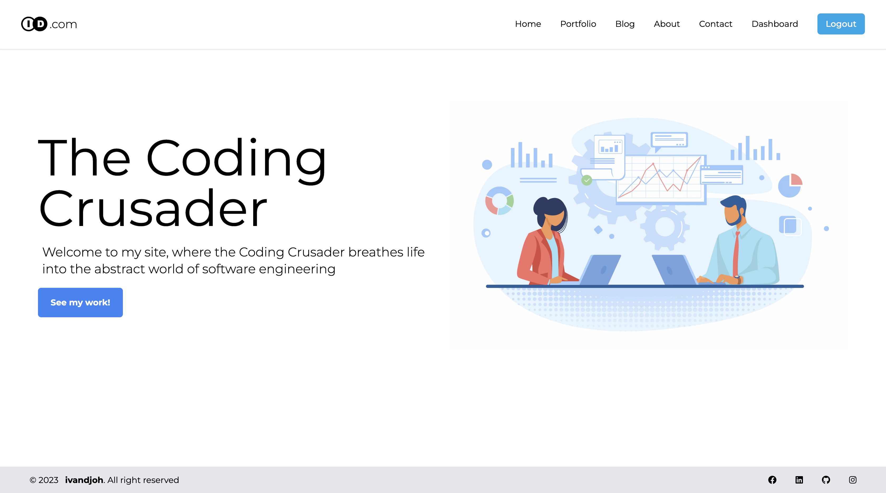

# My NexType

`This Project is a work in progress.`

## Description
`My NexType` is a small project that I am working on to help me learn how to use the [NexType](https://nextjs.org/) framework. I am also using this project to learn how to use [Tailwind CSS](https://tailwindcss.com/). I am also using this project to learn how to use [TypeScript](https://www.typescriptlang.org/).

## Screenshots

## Authors
- [**ivandjoh**](https://linkedin.com/in/ivandjoh)
- [**delvin**](https://linkedin.com/in/delvincakep)
