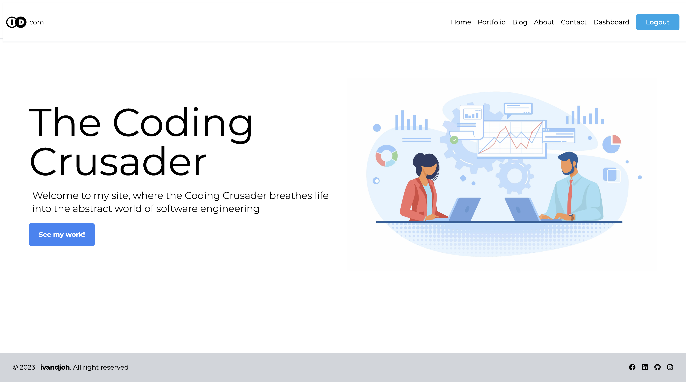
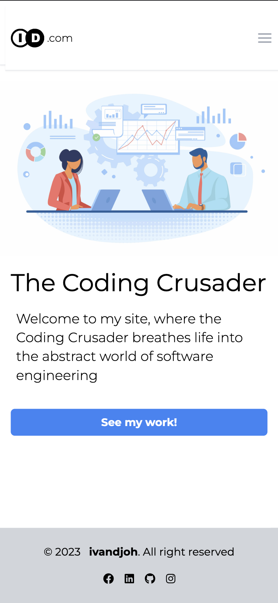

# My NexType

`This Project is a work in progress.`


## Description
`My NexType` is a small project that I am working on to help me learn how to use the [NexType](https://nextjs.org/) framework. I am also using this project to learn how to use [Tailwind CSS](https://tailwindcss.com/). I am also using this project to learn how to use [TypeScript](https://www.typescriptlang.org/).

## Getting Started
### Installation
to install the project, you can use the following command:
```bash
git clone https://github.com/ivandi1980/my-nextype.git
```
then, you can install the dependencies using the following command:
```bash
npm install
# or
yarn install
```


### Usage
to run the project locally, you can use the following command:
```bash
npm run dev  
# or
yarn dev
```

### Build
to build the project, you can use the following command:
```bash
npm run build
# or
yarn build
```


## Screenshots
- Dashboard Desktop
  
- Dashboard Mobile


## Authors
- [**ivandjoh**](https://linkedin.com/in/ivandjoh)
- [**delvin**](https://linkedin.com/in/delvincakep)
